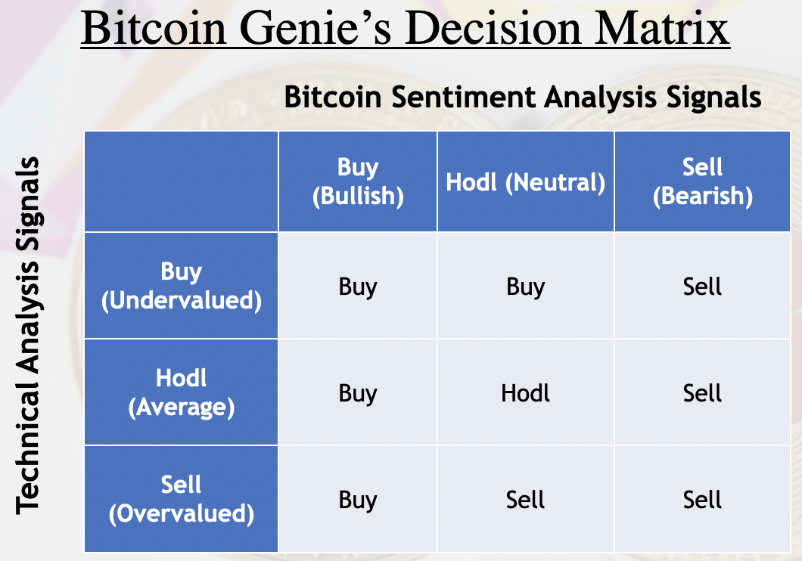

## PROJECT 2 - BITCOIN GENIE: Sentiment Analysis & Algorithmic Trading

---

##  COLLABORATORS
Group 5:
- Coney Dacanay
- Chrishan de Almeida

---
##  DESCRIPTION  

Aside from the daily news, social media platforms, such as Facebook, LinkedIn, Instagram, and Twitter, have become indispensable sources of facts, opinions, and commentaries that influence decision-making whether simply buying a laundry detergent or as critical as investing into cryptocurrency. 

In investing, there is a need to simplify and automate the collection and interpretation of both experts and general public's opinions that can be utilized to predict the price of an asset. This project applies sentiment analysis of data from Twitter in making strategic decisions in trading Bitcoin through an easy-to-use widget, the <strong>Bitcoin Genie</strong>.

---
## METHODOLOGY

**1. Build Bollinger Bands**

 For this project, Bollinger Bands are used to show Bitcoin's price range and volatility. Close prices for the past 20 days are retrieved from Kraken API and used to create a dataframe showing dates and prices, including the calculated upper, mid, and lower bands. 

To trigger trade actions, closing prices are compared to the Bollinger bands and assigned a numerical code 1 to buy, -1 to sell, and 0 to hold. Another column is added on the dataframe to show these signals. 
- If Price < lower band = BUY (undervalued)
- If Price > upper band = SELL (overvalued)
- If lower band < Price < upper band = HODL

**2. Process Sentiment Analysis of Tweets from Twitter**

**_Fetch and clean Twitter Data_**
- Sign up for a Twitter account then apply for a Developer Account in order to generate API keys, which will be used to connect to Twitter and retrieve data.
- Use Tweepy library to fetch tweets. Identify a main search word, for this project it's "Bitcoin", to sieve tweets to be used for sentiment analysis.
- Clean the retrieve tweets through removing special characters and parsing before saving the tweets in a separate text file, _*<strong>TweetHistory.txt*_</strong>.

**_Run Sentiment Analysis and Create Dataframe_** 
Based on 200 retrieved tweets every 30 seconds, sentiment percentage scores are added on a separate dataframe - _*<strong> SentimentHistorical*_</strong>, which is exported as a CSV file, with the retrieved BTC price corresponding to the date and time when the sentiment scores were calculated. Collected data on this CSV file will be used to train the algorithm models and predict prices. 

Trade action signals are triggered by the sentiment scores.
- If Positive tweet % > 50% = BUY (bullish sentiment)
- If Negative tweet % > 50% = SELL (bearish sentiment)
- Neither case = HODL (neutral sentiment)

**3. Machine Learning**
To test and analyze the accuracy in predicting prices in correlation with Twitter sentiments, two machine learning methods were used to train the models.

- **_Classification_**
Random forest 
The dataframe with sentiment scores, only considering positive and negative, and BTC prices was split to training and testing datasets. With the nltk in Python, random forest regressor was used to to fit  the sentiment scores and prices.

- **_Regression_**
Linear regression

**4. Decision-making**

**5. Results and Conclusion**
 Given the limited data gathered from Twitter, models did not show much confidence to prove the correlation between Twitter sentiments and BTC prices. Aside from the volume of data, ensuring the accuracy and relevance of fetched tweets was also a challenge as some of the tweets were not in English and some were just ads or promotions. Thus, there is a big room to improve the sentiment analysis especially on the part of retrieving appropriate messages in order to reflect the accurate sentiments.

---
## USER INTERFACE

**How it was created?**

Using the tknter package

**How to use?**
Just click the blue button that says "Ask ME!" and wait a few seconds for Bitcoin Genie's recommendation based on the most recent Twitter sentiment  and BTC price analyses. 

---
## POTENTIAL FEATURES AND PROJECT EXPANSION

1. Integrate with trading a platform to perform trade actions based on algorithm results. 

2. Incorporate more technical trading indicators such as moving average, exponential moving average, and moving average convergence divergence.

3. May consider sentiment analysis on news API regarding Bitcoin instead or aside from Twitter data.

4. Improve aesthetic of user interface.

---
## GENERAL REFERENCES

- https://github.com/Roibal/Cryptocurrency-Trading-Bots-Python-Beginner-Advance

- https://github.com/IgorWounds/Kraken-API---A-Complete-Guide-Algotrading101/blob/main/Kraken%20Public%20Endpoints.ipynb

- https://medium.com/@BlockchainEng/crypto-trading-bot-sentiment-analysis-bot-bfbd8dd1df5a

